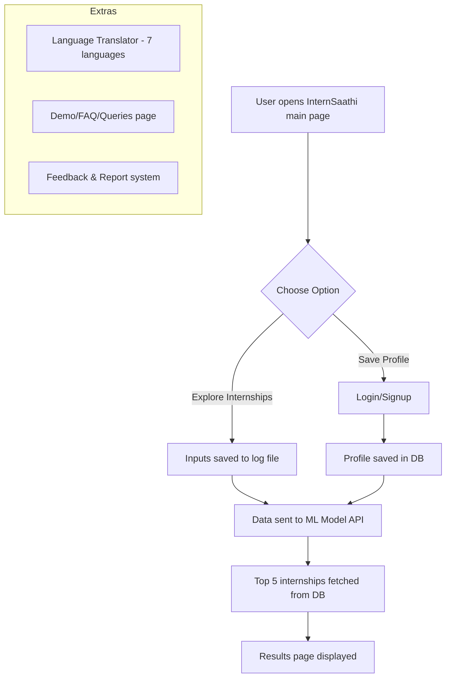

# 🌐 InternSaathi  

**InternSaathi** is a smart, student-friendly internship recommendation platform designed to simplify the process of finding relevant internships while being inclusive for users with low digital literacy and those from rural/low-bandwidth areas.  

The system uses a **TF-IDF + Cosine Similarity ML model** to recommend internships based on user skills, education, and preferences, while supporting **multilingual usability** and **optional account creation** for a smooth, privacy-friendly experience.  

---

## 🚀 Features  

- **Internship Recommendations**  
  - Input: Name, Education, Skills, Internship Type, Duration.  
  - Explore internships instantly (temporary log storage + ML model query).  
  - Save profile (with login/signup + stored preferences).  

- **Multilingual Support**  
  - Translator for **7 Indian languages**.  

- **User Guidance**  
  - Dedicated **Demo / FAQ / Queries** page with explainer video.  

- **Feedback System**  
  - Report & feedback submission stored in DB.  

- **Privacy First**  
  - Optional accounts, minimal data storage, compliance with data sovereignty.  

---

## 🛠 Tech Stack  

- **Frontend** → HTML, CSS (Tailwind), JavaScript  
- **Backend** → FastAPI (Python)  
- **ML Model** → TF-IDF + Cosine Similarity (Scikit-learn)  
- **Database** → MySQL (via SQLAlchemy)  
- **Authentication** → JWT-based login/signup  
- **Deployment** → FastAPI + Uvicorn/Gunicorn, cloud hosting (Render/AWS/Azure)  

---

## ⚙️ Workflow  



---

## 🔒 Security & Privacy  

- JWT-based secure authentication.  
- Minimal storage → only profile data for registered users.   
- Anonymous mode possible (Explore without account).  

---

## 📦 Installation & Setup  

```bash
# Clone repo
git clone https://github.com/irx358/InternSaathi.git
cd InternSaathi

# Install backend deps
pip install -r requirements.txt

# Run FastAPI server
uvicorn main:app --reload
```

---

## 📊 Impact Metrics  

- Internship recommendation accuracy.  
- Student adoption rate.  
- Internship completion rate & feedback.  
- Multilingual feature usage.  

---

## 🌱 Future Roadmap  

- AI-powered **resume builder** for rural students.  
- Integration with **PM Internship Portal**.  
- Personalized dashboards for saved internships.  
- Offline caching & PWA (Progressive Web App) support.  

---

🤝 Connect

🐙 GitHub: <a href="https://github.com/IRX358">IRX358</a>

💼 LinkedIn: <a href="https://www.linkedin.com/irfan358"> Irfan Basha </a>

---

>  © 2025 Irfan IR || 
            Built with CURIOSITY
